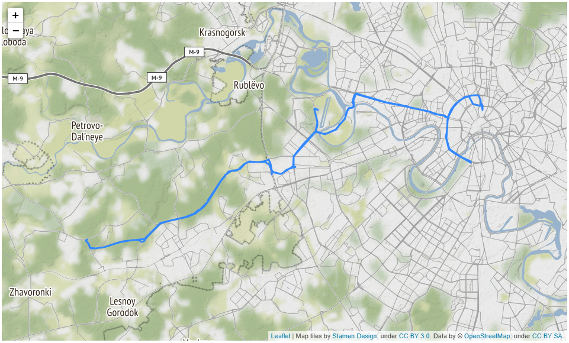
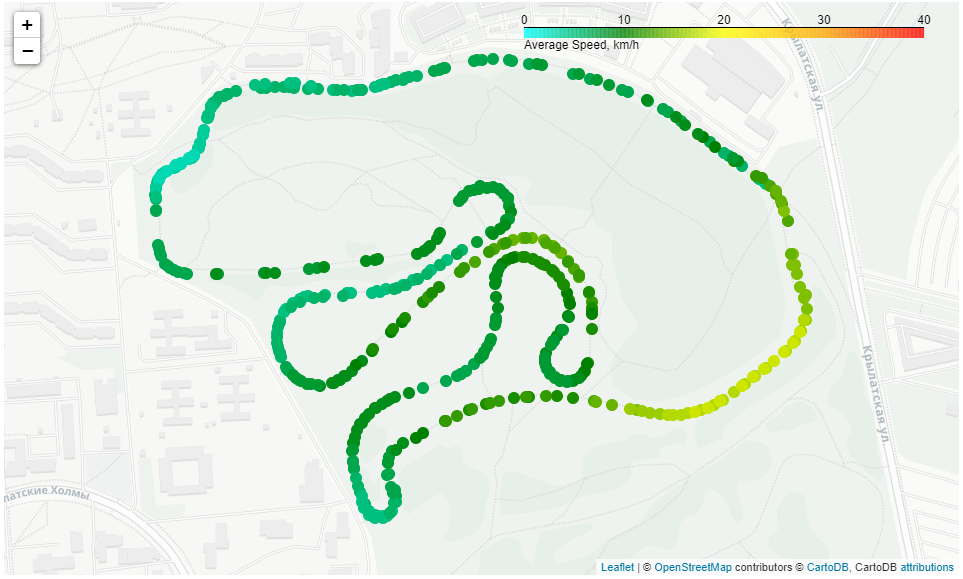
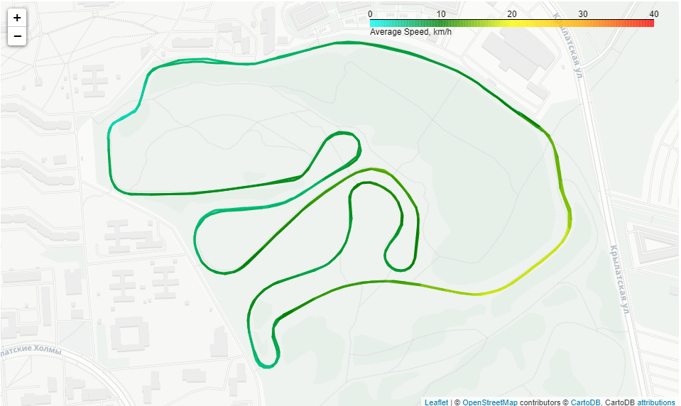
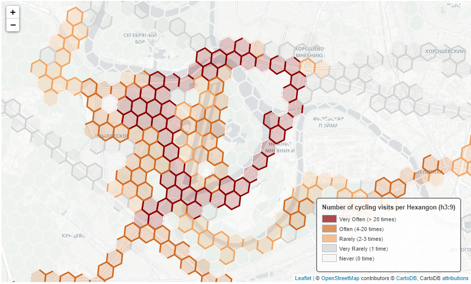

# Spatial Data Analysis for FIT file dataset
Initial description in Russian is available here in the Tutorial acrticle https://habr.com/ru/post/662912/

## About the Project
If you have your FIT files ready in DB format then this repo will help you:
1. [Coordinate Conversion](coordinate_conversion.py) to convert coordinates from Garmin's 32-bit integer format to usual geographical coordinates (WGS-84)

2. [Single Route Map](single_route_map.py) to create a single map for the cycling/walking/running/skiing, etc. route

3. [Speed Map CircleMarker](speed_map.py) to create a speed map for your activity with points symbology

4. [Speed Map Line](speed_map_line.py) to create a speed map for your activity with line symbology

5. [Popular segments](popular_segments_h3.py) to calculate the most popular areas or segments for your type of activity based on H3 hexagons within the defined polygon (like disctict, city, region, etc.)

